# modus-wc-accordion

<!-- Auto Generated Below -->


## Overview

A customizable accordion component used for showing and hiding related groups of content.

The component supports a `<slot>` for injecting `<modus-wc-collapse>` elements. See [Collapse](/docs/components-collapse--docs) docs for additional info.

## Properties

| Property      | Attribute      | Description                                 | Type                  | Default |
| ------------- | -------------- | ------------------------------------------- | --------------------- | ------- |
| `customClass` | `custom-class` | Custom CSS class to apply to the inner div. | `string \| undefined` | `''`    |


## Events

| Event            | Description                                                                                | Type                                                 |
| ---------------- | ------------------------------------------------------------------------------------------ | ---------------------------------------------------- |
| `expandedChange` | When a collapse expanded state is changed, this event outputs the relevant index and state | `CustomEvent<{ expanded: boolean; index: number; }>` |


----------------------------------------------


---

# modus-wc-alert


<!-- Auto Generated Below -->


## Overview

A customizable alert component used to inform the user about important events

## Properties

| Property                  | Attribute           | Description                                         | Type                                                       | Default     |
| ------------------------- | ------------------- | --------------------------------------------------- | ---------------------------------------------------------- | ----------- |
| `alertDescription`        | `alert-description` | The description of the alert.                       | `string \| undefined`                                      | `undefined` |
| `alertTitle` _(required)_ | `alert-title`       | The title of the alert.                             | `string`                                                   | `undefined` |
| `customClass`             | `custom-class`      | Custom CSS class to apply to the outer div element. | `string \| undefined`                                      | `''`        |
| `dismissible`             | `dismissible`       | Whether the alert has a dismiss button              | `boolean \| undefined`                                     | `false`     |
| `icon`                    | `icon`              | The Modus icon to render.                           | `string \| undefined`                                      | `undefined` |
| `role`                    | `role`              | Role taken by the alert. Defaults to 'status'       | `"alert" \| "log" \| "marquee" \| "status" \| "timer"`     | `'status'`  |
| `variant`                 | `variant`           | The variant of the alert.                           | `"error" \| "info" \| "success" \| "warning" \| undefined` | `'info'`    |


## Events

| Event          | Description                                     | Type               |
| -------------- | ----------------------------------------------- | ------------------ |
| `dismissClick` | An event that fires when the alert is dismissed | `CustomEvent<any>` |


## Dependencies

### Depends on

- [modus-wc-icon](../modus-wc-icon)
- [modus-wc-button](../modus-wc-button)

### Graph
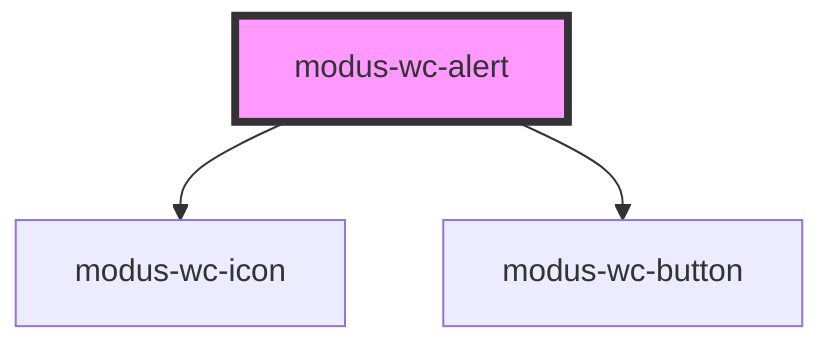

----------------------------------------------


---

# modus-wc-autocomplete


<!-- Auto Generated Below -->


## Overview

A customizable autocomplete component used to create searchable text inputs.

## Properties

| Property        | Attribute         | Description                                                                                             | Type                                  | Default                                                                                                                              |
| --------------- | ----------------- | ------------------------------------------------------------------------------------------------------- | ------------------------------------- | ------------------------------------------------------------------------------------------------------------------------------------ |
| `bordered`      | `bordered`        | Indicates that the autocomplete should have a border.                                                   | `boolean \| undefined`                | `true`                                                                                                                               |
| `customClass`   | `custom-class`    | Custom CSS class to apply to host element.                                                              | `string \| undefined`                 | `''`                                                                                                                                 |
| `debounceMs`    | `debounce-ms`     | The debounce timeout in milliseconds. Set to 0 to disable debouncing.                                   | `number \| undefined`                 | `300`                                                                                                                                |
| `disabled`      | `disabled`        | Whether the form control is disabled.                                                                   | `boolean \| undefined`                | `false`                                                                                                                              |
| `inputId`       | `input-id`        | The ID of the input element.                                                                            | `string \| undefined`                 | `undefined`                                                                                                                          |
| `inputTabIndex` | `input-tab-index` | Determine the control's relative ordering for sequential focus navigation (typically with the Tab key). | `number \| undefined`                 | `undefined`                                                                                                                          |
| `items`         | `items`           | The items to display in the menu. Creating a new array of items will ensure proper component re-render. | `IAutocompleteItem[] \| undefined`    | `[]`                                                                                                                                 |
| `label`         | `label`           | The text to display within the label.                                                                   | `string \| undefined`                 | `undefined`                                                                                                                          |
| `leaveMenuOpen` | `leave-menu-open` | Whether the menu should remain open after an item is selected.                                          | `boolean \| undefined`                | `false`                                                                                                                              |
| `minChars`      | `min-chars`       | The minimum number of characters required to render the menu.                                           | `number`                              | `0`                                                                                                                                  |
| `multiSelect`   | `multi-select`    | Whether the input allows multiple items to be selected.                                                 | `boolean \| undefined`                | `false`                                                                                                                              |
| `name`          | `name`            | Name of the form control. Submitted with the form as part of a name/value pair.                         | `string \| undefined`                 | `undefined`                                                                                                                          |
| `noResults`     | `no-results`      | The content to display when no results are found.                                                       | `IAutocompleteNoResults \| undefined` | `{     ariaLabel: 'No results found',     label: 'No results found',     subLabel: 'Check spelling or try a different keyword',   }` |
| `placeholder`   | `placeholder`     | Text that appears in the form control when it has no value set.                                         | `string \| undefined`                 | `''`                                                                                                                                 |
| `readOnly`      | `read-only`       | Whether the value is editable.                                                                          | `boolean \| undefined`                | `false`                                                                                                                              |
| `required`      | `required`        | A value is required for the form to be submittable.                                                     | `boolean \| undefined`                | `false`                                                                                                                              |
| `showSpinner`   | `show-spinner`    | A spinner that appears when set to true                                                                 | `boolean \| undefined`                | `false`                                                                                                                              |
| `size`          | `size`            | The size of the autocomplete (input and menu).                                                          | `"lg" \| "md" \| "sm" \| undefined`   | `'md'`                                                                                                                               |
| `value`         | `value`           | The value of the control.                                                                               | `string`                              | `''`                                                                                                                                 |


## Events

| Event         | Description                                                                                       | Type                             |
| ------------- | ------------------------------------------------------------------------------------------------- | -------------------------------- |
| `chipRemove`  | Event emitted when a selected item chip is removed.                                               | `CustomEvent<IAutocompleteItem>` |
| `inputBlur`   | Event emitted when the input loses focus.                                                         | `CustomEvent<FocusEvent>`        |
| `inputChange` | Event emitted when the input value changes. This event is debounced based on the debounceMs prop. | `CustomEvent<Event>`             |
| `inputFocus`  | Event emitted when the input gains focus.                                                         | `CustomEvent<FocusEvent>`        |
| `itemSelect`  | Event emitted when a menu item is selected.                                                       | `CustomEvent<IAutocompleteItem>` |


## Dependencies

### Depends on

- [modus-wc-chip](../modus-wc-chip)
- [modus-wc-text-input](../modus-wc-text-input)
- [modus-wc-loader](../modus-wc-loader)
- [modus-wc-menu-item](../modus-wc-menu-item)
- [modus-wc-input-label](../modus-wc-input-label)
- [modus-wc-menu](../modus-wc-menu)

### Graph
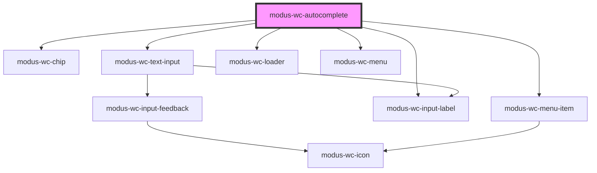

----------------------------------------------


---

# modus-wc-avatar


<!-- Auto Generated Below -->


## Overview

A customizable avatar component used to create avatars with different images.

## Properties

| Property           | Attribute      | Description                                 | Type                                        | Default     |
| ------------------ | -------------- | ------------------------------------------- | ------------------------------------------- | ----------- |
| `alt` _(required)_ | `alt`          | The image alt attribute for accessibility.  | `string`                                    | `undefined` |
| `customClass`      | `custom-class` | Custom CSS class to apply to the inner div. | `string \| undefined`                       | `''`        |
| `imgSrc`           | `img-src`      | The location of the image.                  | `string`                                    | `''`        |
| `shape`            | `shape`        | The shape of the avatar.                    | `"circle" \| "square" \| undefined`         | `'circle'`  |
| `size`             | `size`         | The size of the avatar.                     | `"lg" \| "md" \| "sm" \| "xs" \| undefined` | `'md'`      |


## Dependencies

### Used by

 - [modus-wc-navbar](../modus-wc-navbar)

### Graph
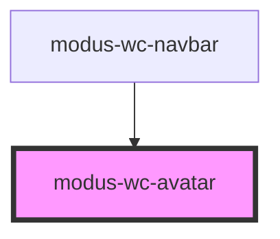

----------------------------------------------


---

# modus-wc-badge


<!-- Auto Generated Below -->


## Overview

A customizable badge component used to create badges with different sizes, types, and colors.

The component supports a `<slot>` for injecting content within the badge.

## Properties

| Property      | Attribute      | Description                                    | Type                                                                                              | Default     |
| ------------- | -------------- | ---------------------------------------------- | ------------------------------------------------------------------------------------------------- | ----------- |
| `color`       | `color`        | The color variant of the badge.                | `"danger" \| "high-contrast" \| "primary" \| "secondary" \| "success" \| "tertiary" \| "warning"` | `'primary'` |
| `customClass` | `custom-class` | Custom CSS class to apply to the span element. | `string`                                                                                          | `''`        |
| `size`        | `size`         | The size of the badge.                         | `"lg" \| "md" \| "sm"`                                                                            | `'md'`      |
| `variant`     | `variant`      | The variant of the badge.                      | `"counter" \| "filled" \| "text"`                                                                 | `'filled'`  |


----------------------------------------------


---

# modus-wc-breadcrumbs


<!-- Auto Generated Below -->


## Overview

A customizable breadcrumbs component used to help users navigate through a website.

## Properties

| Property      | Attribute      | Description                                 | Type                                | Default |
| ------------- | -------------- | ------------------------------------------- | ----------------------------------- | ------- |
| `customClass` | `custom-class` | Custom CSS class to apply to the inner div. | `string \| undefined`               | `''`    |
| `items`       | `items`        | The breadcrumbs to render.                  | `IBreadcrumb[]`                     | `[]`    |
| `size`        | `size`         | The size of the breadcrumbs.                | `"lg" \| "md" \| "sm" \| undefined` | `'md'`  |


## Events

| Event             | Description                                 | Type                       |
| ----------------- | ------------------------------------------- | -------------------------- |
| `breadcrumbClick` | Event emitted when a breadcrumb is clicked. | `CustomEvent<IBreadcrumb>` |


----------------------------------------------


---

# modus-wc-button

<!-- Auto Generated Below -->


## Overview

A customizable button component used to create buttons with different sizes, variants, and types.

The component supports a `<slot>` for injecting content within the button, similar to a native HTML button

## Properties

| Property      | Attribute      | Description                                                          | Type                                                              | Default       |
| ------------- | -------------- | -------------------------------------------------------------------- | ----------------------------------------------------------------- | ------------- |
| `color`       | `color`        | The color variant of the button.                                     | `"danger" \| "primary" \| "secondary" \| "tertiary" \| "warning"` | `'primary'`   |
| `customClass` | `custom-class` | Custom CSS class to apply to the button element.                     | `string \| undefined`                                             | `''`          |
| `disabled`    | `disabled`     | If true, the button will be disabled.                                | `boolean \| undefined`                                            | `false`       |
| `fullWidth`   | `full-width`   | If true, the button will take the full width of its container.       | `boolean \| undefined`                                            | `false`       |
| `pressed`     | `pressed`      | If true, the button will be in a pressed state (for toggle buttons). | `boolean \| undefined`                                            | `false`       |
| `shape`       | `shape`        | The shape of the button.                                             | `"circle" \| "rectangle" \| "square"`                             | `'rectangle'` |
| `size`        | `size`         | The size of the button.                                              | `"lg" \| "md" \| "sm" \| "xs"`                                    | `'md'`        |
| `type`        | `type`         | The type of the button.                                              | `"button" \| "reset" \| "submit"`                                 | `'button'`    |
| `variant`     | `variant`      | The variant of the button.                                           | `"borderless" \| "filled" \| "outlined"`                          | `'filled'`    |


## Events

| Event         | Description                                                         | Type                                       |
| ------------- | ------------------------------------------------------------------- | ------------------------------------------ |
| `buttonClick` | Event emitted when the button is clicked or activated via keyboard. | `CustomEvent<KeyboardEvent \| MouseEvent>` |


## Dependencies

### Used by

 - [modus-wc-alert](../modus-wc-alert)
 - [modus-wc-modal](../modus-wc-modal)
 - [modus-wc-navbar](../modus-wc-navbar)

### Graph
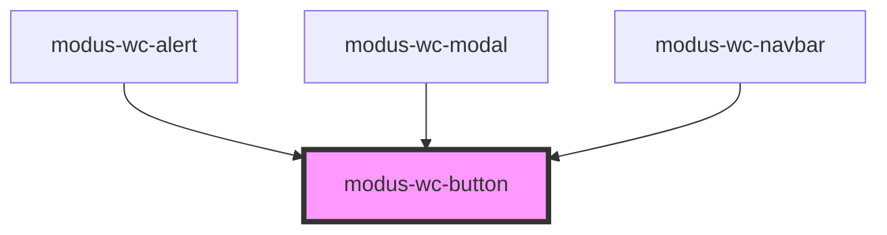

----------------------------------------------


---

# modus-wc-card


<!-- Auto Generated Below -->


## Overview

A customizable card component used to group and display content in a way that is easily readable

## Properties

| Property           | Attribute           | Description                                                   | Type                                      | Default      |
| ------------------ | ------------------- | ------------------------------------------------------------- | ----------------------------------------- | ------------ |
| `backgroundFigure` | `background-figure` | Makes any \<figure> in the 'header' slot cover the background | `boolean \| undefined`                    | `false`      |
| `bordered`         | `bordered`          | Adds a hard border to the card                                | `boolean \| undefined`                    | `false`      |
| `customClass`      | `custom-class`      | Custom CSS class to apply                                     | `string \| undefined`                     | `''`         |
| `layout`           | `layout`            | Determines how the card is laid out                           | `"horizontal" \| "vertical" \| undefined` | `'vertical'` |
| `padding`          | `padding`           | Determines if the interior padding is compact or not          | `"compact" \| "normal" \| undefined`      | `'normal'`   |


## Dependencies

### Used by

 - [modus-wc-navbar](../modus-wc-navbar)

### Graph
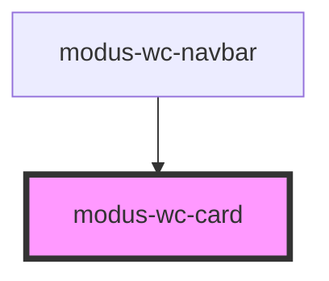

----------------------------------------------


---

# modus-wc-checkbox


<!-- Auto Generated Below -->


## Overview

A customizable checkbox component

## Properties

| Property        | Attribute         | Description                                                                     | Type                                | Default     |
| --------------- | ----------------- | ------------------------------------------------------------------------------- | ----------------------------------- | ----------- |
| `customClass`   | `custom-class`    | Custom CSS class to apply to the inner div.                                     | `string \| undefined`               | `''`        |
| `disabled`      | `disabled`        | The disabled state of the checkbox.                                             | `boolean \| undefined`              | `false`     |
| `indeterminate` | `indeterminate`   | The indeterminate state of the checkbox.                                        | `boolean`                           | `false`     |
| `inputId`       | `input-id`        | The ID of the input element.                                                    | `string \| undefined`               | `undefined` |
| `inputTabIndex` | `input-tab-index` | The tabindex of the input.                                                      | `number \| undefined`               | `undefined` |
| `label`         | `label`           | The text to display within the label.                                           | `string \| undefined`               | `undefined` |
| `name`          | `name`            | Name of the form control. Submitted with the form as part of a name/value pair. | `string \| undefined`               | `''`        |
| `required`      | `required`        | A value is required for the form to be submittable.                             | `boolean \| undefined`              | `false`     |
| `size`          | `size`            | The size of the input.                                                          | `"lg" \| "md" \| "sm" \| undefined` | `'md'`      |
| `value`         | `value`           | The value of the checkbox.                                                      | `boolean`                           | `false`     |


## Events

| Event         | Description                           | Type                      |
| ------------- | ------------------------------------- | ------------------------- |
| `inputBlur`   | Emitted when the input loses focus.   | `CustomEvent<FocusEvent>` |
| `inputChange` | Emitted when the input value changes. | `CustomEvent<InputEvent>` |
| `inputFocus`  | Emitted when the input gains focus.   | `CustomEvent<FocusEvent>` |


## Dependencies

### Used by

 - [modus-wc-table](../modus-wc-table)

### Depends on

- [modus-wc-input-label](../modus-wc-input-label)

### Graph
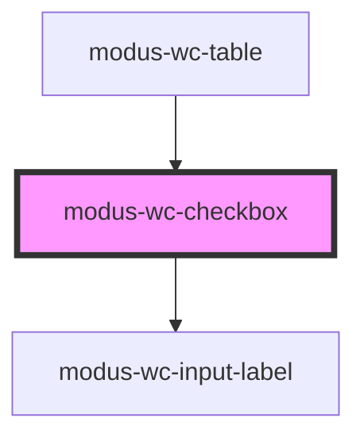

----------------------------------------------


---

# modus-wc-chip


<!-- Auto Generated Below -->


## Overview

A customizable chip component used to display information in a compact area

## Properties

| Property      | Attribute      | Description                                               | Type                                 | Default    |
| ------------- | -------------- | --------------------------------------------------------- | ------------------------------------ | ---------- |
| `active`      | `active`       | Active state of chip.                                     | `boolean \| undefined`               | `false`    |
| `customClass` | `custom-class` | Custom CSS class to apply to the inner div.               | `string \| undefined`                | `''`       |
| `disabled`    | `disabled`     | Whether the chip is disabled.                             | `boolean \| undefined`               | `false`    |
| `hasError`    | `has-error`    | Whether the chip has an error.                            | `boolean \| undefined`               | `false`    |
| `label`       | `label`        | The label to display in the chip.                         | `string \| undefined`                | `''`       |
| `showRemove`  | `show-remove`  | Whether to show the close icon on right side of the chip. | `boolean \| undefined`               | `false`    |
| `size`        | `size`         | The size of the chip.                                     | `"lg" \| "md" \| "sm" \| undefined`  | `'md'`     |
| `variant`     | `variant`      | The variant of the chip.                                  | `"filled" \| "outline" \| undefined` | `'filled'` |


## Events

| Event        | Description                                                       | Type                                       |
| ------------ | ----------------------------------------------------------------- | ------------------------------------------ |
| `chipClick`  | Event emitted when the chip is clicked or activated via keyboard. | `CustomEvent<KeyboardEvent \| MouseEvent>` |
| `chipRemove` | Event emitted when the close chip icon button is clicked.         | `CustomEvent<KeyboardEvent \| MouseEvent>` |


## Dependencies

### Used by

 - [modus-wc-autocomplete](../modus-wc-autocomplete)

### Graph
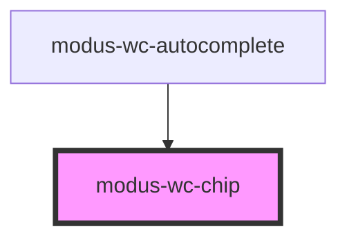

----------------------------------------------


---

# modus-wc-collapse


<!-- Auto Generated Below -->


## Overview

A customizable collapse component used for showing and hiding content.

The component supports a 'header' and 'content' `<slot>` for injecting custom HTML.
Do not set

## Properties

| Property      | Attribute      | Description                                                                                                                           | Type                            | Default     |
| ------------- | -------------- | ------------------------------------------------------------------------------------------------------------------------------------- | ------------------------------- | ----------- |
| `bordered`    | `bordered`     | Indicates that the component should have a border.                                                                                    | `boolean \| undefined`          | `false`     |
| `collapseId`  | `collapse-id`  | A unique identifier used to set the id attributes of various elements.                                                                | `string \| undefined`           | `undefined` |
| `customClass` | `custom-class` | Custom CSS class to apply to the outer div.                                                                                           | `string \| undefined`           | `''`        |
| `expanded`    | `expanded`     | Controls whether the collapse is expanded or not.                                                                                     | `boolean \| undefined`          | `false`     |
| `options`     | `options`      | Configuration options for rendering the pre-laid out collapse component. Do not set this prop if you intend to use the 'header' slot. | `ICollapseOptions \| undefined` | `undefined` |


## Events

| Event            | Description                                                 | Type                                  |
| ---------------- | ----------------------------------------------------------- | ------------------------------------- |
| `expandedChange` | Event emitted when the expanded prop is internally changed. | `CustomEvent<{ expanded: boolean; }>` |


## Dependencies

### Depends on

- [modus-wc-icon](../modus-wc-icon)

### Graph
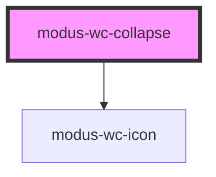

----------------------------------------------


---

# modus-wc-date


<!-- Auto Generated Below -->


## Overview

A customizable date picker component used to create date inputs.

Adheres to WCAG 2.2 standards.

## Properties

| Property        | Attribute         | Description                                                                                             | Type                                | Default     |
| --------------- | ----------------- | ------------------------------------------------------------------------------------------------------- | ----------------------------------- | ----------- |
| `bordered`      | `bordered`        | Indicates that the input should have a border.                                                          | `boolean \| undefined`              | `true`      |
| `customClass`   | `custom-class`    | Custom CSS class to apply to the input.                                                                 | `string \| undefined`               | `''`        |
| `disabled`      | `disabled`        | Whether the form control is disabled.                                                                   | `boolean \| undefined`              | `false`     |
| `feedback`      | `feedback`        | Feedback to render below the input.                                                                     | `IInputFeedbackProp \| undefined`   | `undefined` |
| `inputId`       | `input-id`        | The ID of the input element.                                                                            | `string \| undefined`               | `undefined` |
| `inputTabIndex` | `input-tab-index` | Determine the control's relative ordering for sequential focus navigation (typically with the Tab key). | `number \| undefined`               | `undefined` |
| `label`         | `label`           | The text to display within the label.                                                                   | `string \| undefined`               | `undefined` |
| `max`           | `max`             | Maximum date value.                                                                                     | `string \| undefined`               | `undefined` |
| `min`           | `min`             | Minimum date value.                                                                                     | `string \| undefined`               | `undefined` |
| `name`          | `name`            | Name of the form control. Submitted with the form as part of a name/value pair.                         | `string \| undefined`               | `undefined` |
| `readOnly`      | `read-only`       | Whether the value is editable.                                                                          | `boolean \| undefined`              | `false`     |
| `required`      | `required`        | A value is required or must be checked for the form to be submittable.                                  | `boolean \| undefined`              | `false`     |
| `size`          | `size`            | The size of the input.                                                                                  | `"lg" \| "md" \| "sm" \| undefined` | `'md'`      |
| `value`         | `value`           | The value of the control (yyyy-mm-dd).                                                                  | `string`                            | `''`        |


## Events

| Event         | Description                                 | Type                      |
| ------------- | ------------------------------------------- | ------------------------- |
| `inputBlur`   | Event emitted when the input loses focus.   | `CustomEvent<FocusEvent>` |
| `inputChange` | Event emitted when the input value changes. | `CustomEvent<InputEvent>` |
| `inputFocus`  | Event emitted when the input gains focus.   | `CustomEvent<FocusEvent>` |


## Dependencies

### Depends on

- [modus-wc-input-label](../modus-wc-input-label)
- [modus-wc-input-feedback](../modus-wc-input-feedback)

### Graph
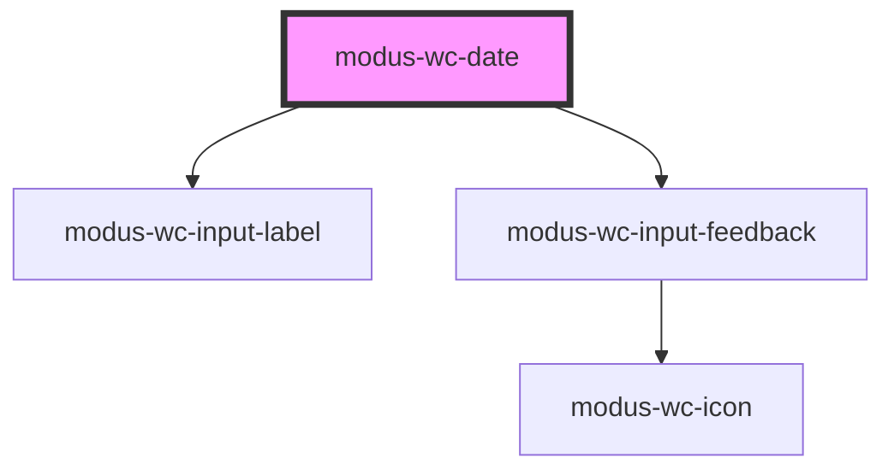

----------------------------------------------


---

# modus-wc-divider


<!-- Auto Generated Below -->


## Overview

A customizable divider component used to separate content horizontally or vertically

## Properties

| Property      | Attribute      | Description                                                                                              | Type                                                                                                           | Default      |
| ------------- | -------------- | -------------------------------------------------------------------------------------------------------- | -------------------------------------------------------------------------------------------------------------- | ------------ |
| `color`       | `color`        | The color of the divider line.                                                                           | `"danger" \| "high-contrast" \| "primary" \| "secondary" \| "success" \| "tertiary" \| "warning" \| undefined` | `'tertiary'` |
| `content`     | `content`      | The content to display in the divider.                                                                   | `string \| undefined`                                                                                          | `''`         |
| `customClass` | `custom-class` | Custom CSS class to apply to the divider element.                                                        | `string \| undefined`                                                                                          | `''`         |
| `orientation` | `orientation`  | The orientation of the divider. This is in reference to how content will be rendered around the divider. | `"horizontal" \| "vertical" \| undefined`                                                                      | `'vertical'` |
| `position`    | `position`     | The position of the divider.                                                                             | `"center" \| "end" \| "start" \| undefined`                                                                    | `'center'`   |
| `responsive`  | `responsive`   | Whether the divider is responsive or not.                                                                | `boolean \| undefined`                                                                                         | `true`       |


----------------------------------------------


---

# modus-wc-icon


<!-- Auto Generated Below -->


## Overview

A customizable icon component used to render Modus icons.

<b>This component requires Modus icons to be installed in the host application. See [Modus Icon Usage](/docs/documentation-modus-icon-usage--docs) for steps.</b>

## Properties

| Property            | Attribute      | Description                                                                                                              | Type                                        | Default     |
| ------------------- | -------------- | ------------------------------------------------------------------------------------------------------------------------ | ------------------------------------------- | ----------- |
| `customClass`       | `custom-class` | Custom CSS class to apply to the i element.                                                                              | `string \| undefined`                       | `''`        |
| `decorative`        | `decorative`   | Indicates that the icon is decorative. When true, sets aria-hidden to hide the icon from screen readers.                 | `boolean \| undefined`                      | `true`      |
| `name` _(required)_ | `name`         | The icon name, should match the CSS class in the icon font.                                                              | `string`                                    | `undefined` |
| `size`              | `size`         | The icon size, can be "sm", "md", "lg" (a custom size can be specified in CSS). This adjusts the font size for the icon. | `"lg" \| "md" \| "sm" \| "xs" \| undefined` | `'md'`      |


## Dependencies

### Used by

 - [modus-wc-alert](../modus-wc-alert)
 - [modus-wc-collapse](../modus-wc-collapse)
 - [modus-wc-input-feedback](../modus-wc-input-feedback)
 - [modus-wc-menu-item](../modus-wc-menu-item)
 - [modus-wc-table](../modus-wc-table)
 - [modus-wc-tabs](../modus-wc-tabs)

### Graph
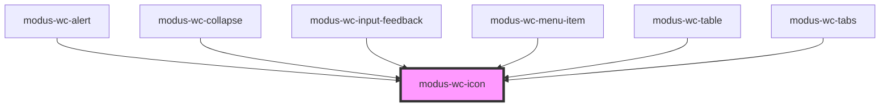

----------------------------------------------


---

# modus-wc-input-feedback


<!-- Auto Generated Below -->


## Overview

A customizable feedback component used to provide additional context related to form input interactions.

<b>To use a custom icon, this component requires Modus icons to be installed in the host application. See [Modus Icon Usage](/docs/documentation-modus-icon-usage--docs) for steps.</b>

## Properties

| Property             | Attribute      | Description                                                   | Type                                          | Default     |
| -------------------- | -------------- | ------------------------------------------------------------- | --------------------------------------------- | ----------- |
| `customClass`        | `custom-class` | Custom CSS class to apply to the outer div element.           | `string \| undefined`                         | `''`        |
| `icon`               | `icon`         | The Modus icon to use instead of the pre-defined icons.       | `string \| undefined`                         | `''`        |
| `level` _(required)_ | `level`        | The level informs which icon and color that will be rendered. | `"error" \| "info" \| "success" \| "warning"` | `undefined` |
| `message`            | `message`      | The message.                                                  | `string \| undefined`                         | `''`        |
| `size`               | `size`         | The size of the feedback component.                           | `"lg" \| "md" \| "sm" \| undefined`           | `'md'`      |


## Dependencies

### Used by

 - [modus-wc-date](../modus-wc-date)
 - [modus-wc-number-input](../modus-wc-number-input)
 - [modus-wc-select](../modus-wc-select)
 - [modus-wc-text-input](../modus-wc-text-input)
 - [modus-wc-textarea](../modus-wc-textarea)
 - [modus-wc-time-input](../modus-wc-time-input)

### Depends on

- [modus-wc-icon](../modus-wc-icon)

### Graph
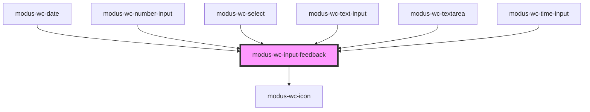

----------------------------------------------


---

# modus-wc-input-label


<!-- Auto Generated Below -->


## Overview

A customizable input label component.

The component supports a `<slot>` for injecting additional custom content inside the label, such as icons or formatted text

## Properties

| Property       | Attribute        | Description                                                                  | Type                                | Default     |
| -------------- | ---------------- | ---------------------------------------------------------------------------- | ----------------------------------- | ----------- |
| `customClass`  | `custom-class`   | Additional classes for custom styling.                                       | `string \| undefined`               | `''`        |
| `forId`        | `for-id`         | The `for` attribute of the label, matching the `id` of the associated input. | `string \| undefined`               | `undefined` |
| `labelText`    | `label-text`     | The text to display within the label.                                        | `string \| undefined`               | `undefined` |
| `required`     | `required`       | Whether the label indicates a required field.                                | `boolean \| undefined`              | `false`     |
| `size`         | `size`           | The size of the label.                                                       | `"lg" \| "md" \| "sm" \| undefined` | `'md'`      |
| `subLabelText` | `sub-label-text` | The text rendered beneath the label.                                         | `string \| undefined`               | `undefined` |


## Dependencies

### Used by

 - [modus-wc-autocomplete](../modus-wc-autocomplete)
 - [modus-wc-checkbox](../modus-wc-checkbox)
 - [modus-wc-date](../modus-wc-date)
 - [modus-wc-number-input](../modus-wc-number-input)
 - [modus-wc-progress](../modus-wc-progress)
 - [modus-wc-radio](../modus-wc-radio)
 - [modus-wc-select](../modus-wc-select)
 - [modus-wc-slider](../modus-wc-slider)
 - [modus-wc-switch](../modus-wc-switch)
 - [modus-wc-text-input](../modus-wc-text-input)
 - [modus-wc-textarea](../modus-wc-textarea)
 - [modus-wc-time-input](../modus-wc-time-input)

### Graph
```mermaid
graph TD;
  modus-wc-autocomplete --> modus-wc-input-label
  modus-wc-checkbox --> modus-wc-input-label
  modus-wc-date --> modus-wc-input-label
  modus-wc-number-input --> modus-wc-input-label
  modus-wc-progress --> modus-wc-input-label
  modus-wc-radio --> modus-wc-input-label
  modus-wc-select --> modus-wc-input-label
  modus-wc-slider --> modus-wc-input-label
  modus-wc-switch --> modus-wc-input-label
  modus-wc-text-input --> modus-wc-input-label
  modus-wc-textarea --> modus-wc-input-label
  modus-wc-time-input --> modus-wc-input-label
  style modus-wc-input-label fill:#f9f,stroke:#333,stroke-width:4px
```

----------------------------------------------


---

# modus-wc-loader


<!-- Auto Generated Below -->


## Overview

A customizable loader component used to indicate the loading of content

## Properties

| Property      | Attribute      | Description                                      | Type                                                                                               | Default     |
| ------------- | -------------- | ------------------------------------------------ | -------------------------------------------------------------------------------------------------- | ----------- |
| `color`       | `color`        | The color of the loader.                         | `"accent" \| "error" \| "info" \| "neutral" \| "primary" \| "secondary" \| "success" \| "warning"` | `'primary'` |
| `customClass` | `custom-class` | Custom CSS class to apply to the loader element. | `string \| undefined`                                                                              | `''`        |
| `size`        | `size`         | The size of the loader.                          | `"lg" \| "md" \| "sm" \| "xs"`                                                                     | `'md'`      |
| `variant`     | `variant`      | The variant of the loader.                       | `"ball" \| "bars" \| "dots" \| "infinity" \| "ring" \| "spinner"`                                  | `'spinner'` |


## Dependencies

### Used by

 - [modus-wc-autocomplete](../modus-wc-autocomplete)

### Graph
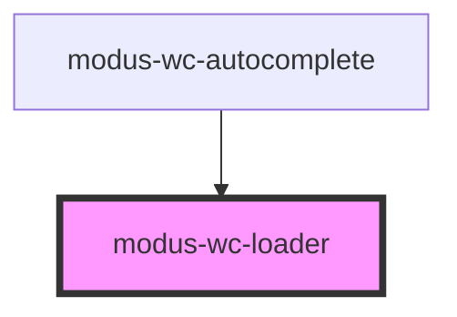

----------------------------------------------


---

# modus-wc-menu


<!-- Auto Generated Below -->


## Overview

A customizable menu component used to display a list of li elements vertically or horizontally.

The component supports a `<slot>` for injecting custom li elements inside the ul

## Properties

| Property      | Attribute      | Description                                   | Type                                      | Default      |
| ------------- | -------------- | --------------------------------------------- | ----------------------------------------- | ------------ |
| `bordered`    | `bordered`     | Indicates that the menu should have a border. | `boolean \| undefined`                    | `undefined`  |
| `customClass` | `custom-class` | Custom CSS class to apply to the ul element.  | `string \| undefined`                     | `''`         |
| `orientation` | `orientation`  | The orientation of the menu.                  | `"horizontal" \| "vertical" \| undefined` | `'vertical'` |
| `size`        | `size`         | The size of the menu.                         | `"lg" \| "md" \| "sm" \| undefined`       | `'md'`       |


## Dependencies

### Used by

 - [modus-wc-autocomplete](../modus-wc-autocomplete)
 - [modus-wc-navbar](../modus-wc-navbar)

### Graph
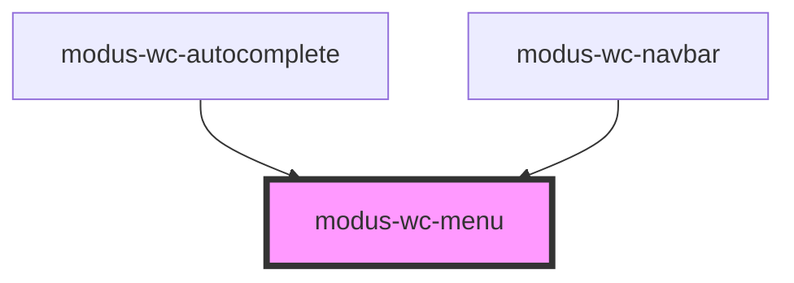

----------------------------------------------


---

# modus-wc-menu-item


<!-- Auto Generated Below -->


## Overview

A customizable menu item component used to display the item portion of a menu

## Properties

| Property      | Attribute      | Description                                                  | Type                                | Default     |
| ------------- | -------------- | ------------------------------------------------------------ | ----------------------------------- | ----------- |
| `bordered`    | `bordered`     |                                                              | `boolean \| undefined`              | `undefined` |
| `customClass` | `custom-class` | Custom CSS class to apply to the li element.                 | `string \| undefined`               | `''`        |
| `disabled`    | `disabled`     | The disabled state of the menu item.                         | `boolean \| undefined`              | `undefined` |
| `focused`     | `focused`      | The focused state of the menu item.                          | `boolean \| undefined`              | `undefined` |
| `label`       | `label`        | The text rendered in the menu item.                          | `string`                            | `''`        |
| `selected`    | `selected`     | The selected state of the menu item.                         | `boolean \| undefined`              | `undefined` |
| `size`        | `size`         | The size of the menu item.                                   | `"lg" \| "md" \| "sm" \| undefined` | `'md'`      |
| `startIcon`   | `start-icon`   | The modus icon name to render on the start of the menu item. | `string \| undefined`               | `undefined` |
| `subLabel`    | `sub-label`    | The text rendered beneath the label.                         | `string \| undefined`               | `undefined` |
| `value`       | `value`        | The unique identifying value of the menu item.               | `string`                            | `''`        |


## Events

| Event        | Description                                 | Type                              |
| ------------ | ------------------------------------------- | --------------------------------- |
| `itemSelect` | Event emitted when a menu item is selected. | `CustomEvent<{ value: string; }>` |


## Dependencies

### Used by

 - [modus-wc-autocomplete](../modus-wc-autocomplete)
 - [modus-wc-navbar](../modus-wc-navbar)

### Depends on

- [modus-wc-icon](../modus-wc-icon)

### Graph
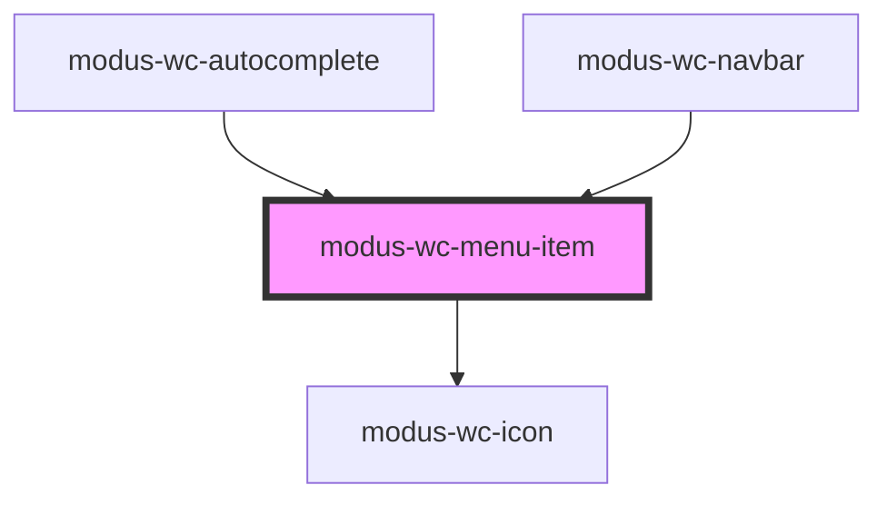

----------------------------------------------


---

# modus-wc-modal


<!-- Auto Generated Below -->


## Overview

A customizable modal component used to display content in a dialog.

The component supports a 'header', 'content', and 'footer' <slot> for injecting custom HTML

## Properties

| Property               | Attribute                | Description                                                                                                                | Type                                         | Default     |
| ---------------------- | ------------------------ | -------------------------------------------------------------------------------------------------------------------------- | -------------------------------------------- | ----------- |
| `backdrop`             | `backdrop`               | The modal's backdrop. Specify 'static' for a backdrop that doesn't close the modal when clicked outside the modal content. | `"default" \| "static" \| undefined`         | `'default'` |
| `customClass`          | `custom-class`           | Custom CSS class to apply                                                                                                  | `string \| undefined`                        | `''`        |
| `fullscreen`           | `fullscreen`             | Specifies whether the modal should be displayed full-screen                                                                | `boolean \| undefined`                       | `false`     |
| `modalId` _(required)_ | `modal-id`               | The ID of the inner dialog element                                                                                         | `string`                                     | `undefined` |
| `position`             | `position`               | Specifies the position of the modal                                                                                        | `"bottom" \| "center" \| "top" \| undefined` | `'center'`  |
| `showClose`            | `show-close`             | Specifies whether to show the close icon button at the top right of modal                                                  | `boolean \| undefined`                       | `true`      |
| `showFullscreenToggle` | `show-fullscreen-toggle` | Specifies whether to show the fullscreen toggle icon button                                                                | `boolean \| undefined`                       | `false`     |


## Dependencies

### Depends on

- [modus-wc-button](../modus-wc-button)

### Graph
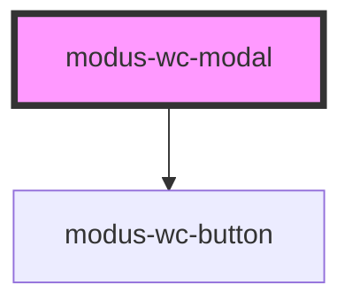

----------------------------------------------


---

# modus-wc-navbar


<!-- Auto Generated Below -->


## Overview

A customizable navbar component used for top level navigation of all Trimble applications.

The component supports a 'main-menu', 'notifications', and 'apps' `<slot>` for injecting custom HTML menus.
It also supports a 'start', 'center', and 'end' `<slot>` for injecting additional custom HTML

## Properties

| Property                | Attribute                 | Description                                                                                  | Type                                | Default                                                                                                                                                            |
| ----------------------- | ------------------------- | -------------------------------------------------------------------------------------------- | ----------------------------------- | ------------------------------------------------------------------------------------------------------------------------------------------------------------------ |
| `appsMenuOpen`          | `apps-menu-open`          | The open state of the apps menu.                                                             | `boolean \| undefined`              | `false`                                                                                                                                                            |
| `condensed`             | `condensed`               | Applies condensed layout and styling.                                                        | `boolean \| undefined`              | `false`                                                                                                                                                            |
| `condensedMenuOpen`     | `condensed-menu-open`     | The open state of the condensed menu.                                                        | `boolean \| undefined`              | `false`                                                                                                                                                            |
| `customClass`           | `custom-class`            | Custom CSS class to apply to the host element.                                               | `string \| undefined`               | `''`                                                                                                                                                               |
| `mainMenuOpen`          | `main-menu-open`          | The open state of the main menu.                                                             | `boolean \| undefined`              | `false`                                                                                                                                                            |
| `notificationsMenuOpen` | `notifications-menu-open` | The open state of the notifications menu.                                                    | `boolean \| undefined`              | `false`                                                                                                                                                            |
| `searchDebounceMs`      | `search-debounce-ms`      | Debounce time in milliseconds for search input changes. Default is 300ms.                    | `number \| undefined`               | `300`                                                                                                                                                              |
| `searchInputOpen`       | `search-input-open`       | The open state of the search input.                                                          | `boolean \| undefined`              | `false`                                                                                                                                                            |
| `textOverrides`         | `text-overrides`          | Text replacements for the navbar.                                                            | `INavbarTextOverrides \| undefined` | `undefined`                                                                                                                                                        |
| `userCard` _(required)_ | `user-card`               | User information used to render the user card.                                               | `INavbarUserCard`                   | `undefined`                                                                                                                                                        |
| `userMenuOpen`          | `user-menu-open`          | The open state of the user menu.                                                             | `boolean \| undefined`              | `false`                                                                                                                                                            |
| `visibility`            | `visibility`              | The visibility of individual navbar buttons. Default is user profile visible, others hidden. | `INavbarVisibility \| undefined`    | `{     ai: false,     apps: false,     help: false,     mainMenu: false,     notifications: false,     search: false,     searchInput: false,     user: true,   }` |


## Events

| Event                         | Description                                                                                       | Type                                       |
| ----------------------------- | ------------------------------------------------------------------------------------------------- | ------------------------------------------ |
| `aiClick`                     | Event emitted when the AI button is clicked or activated via keyboard.                            | `CustomEvent<KeyboardEvent \| MouseEvent>` |
| `appsClick`                   | Event emitted when the apps button is clicked or activated via keyboard.                          | `CustomEvent<KeyboardEvent \| MouseEvent>` |
| `appsMenuOpenChange`          | Event emitted when the apps menu open state changes.                                              | `CustomEvent<boolean>`                     |
| `condensedMenuOpenChange`     | Event emitted when the condensed menu open state changes.                                         | `CustomEvent<boolean>`                     |
| `helpClick`                   | Event emitted when the help button is clicked or activated via keyboard.                          | `CustomEvent<KeyboardEvent \| MouseEvent>` |
| `mainMenuOpenChange`          | Event emitted when the main menu open state changes.                                              | `CustomEvent<boolean>`                     |
| `myTrimbleClick`              | Event emitted when the user profile Access MyTrimble button is clicked or activated via keyboard. | `CustomEvent<KeyboardEvent \| MouseEvent>` |
| `notificationsClick`          | Event emitted when the notifications button is clicked or activated via keyboard.                 | `CustomEvent<KeyboardEvent \| MouseEvent>` |
| `notificationsMenuOpenChange` | Event emitted when the notifications menu open state changes.                                     | `CustomEvent<boolean>`                     |
| `searchChange`                | Event emitted when the search input value is changed.                                             | `CustomEvent<{ value: string; }>`          |
| `searchClick`                 | Event emitted when the search button is clicked or activated via keyboard.                        | `CustomEvent<KeyboardEvent \| MouseEvent>` |
| `searchInputOpenChange`       | Event emitted when the search input open state changes.                                           | `CustomEvent<boolean>`                     |
| `signOutClick`                | Event emitted when the user profile sign out button is clicked or activated via keyboard.         | `CustomEvent<KeyboardEvent \| MouseEvent>` |
| `trimbleLogoClick`            | Event emitted when the Trimble logo is clicked or activated via keyboard.                         | `CustomEvent<KeyboardEvent \| MouseEvent>` |
| `userMenuOpenChange`          | Event emitted when the user menu open state changes.                                              | `CustomEvent<boolean>`                     |


## Dependencies

### Depends on

- [modus-wc-toolbar](../modus-wc-toolbar)
- [modus-wc-button](../modus-wc-button)
- [modus-wc-menu](../modus-wc-menu)
- [modus-wc-menu-item](../modus-wc-menu-item)
- [modus-wc-text-input](../modus-wc-text-input)
- [modus-wc-avatar](../modus-wc-avatar)
- [modus-wc-card](../modus-wc-card)

### Graph
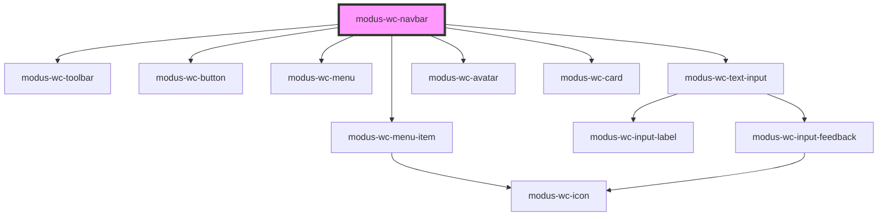

----------------------------------------------


---

# modus-wc-number-input


<!-- Auto Generated Below -->


## Overview

A customizable input component used to create number inputs with types

## Properties

| Property         | Attribute         | Description                                                                                                                                                              | Type                                | Default     |
| ---------------- | ----------------- | ------------------------------------------------------------------------------------------------------------------------------------------------------------------------ | ----------------------------------- | ----------- |
| `autoComplete`   | `auto-complete`   | Hint for form autofill feature.                                                                                                                                          | `"off" \| "on" \| undefined`        | `undefined` |
| `bordered`       | `bordered`        | Indicates that the input should have a border.                                                                                                                           | `boolean \| undefined`              | `true`      |
| `currencySymbol` | `currency-symbol` | The currency symbol to display.                                                                                                                                          | `string \| undefined`               | `''`        |
| `customClass`    | `custom-class`    | Custom CSS class to apply to the input.                                                                                                                                  | `string \| undefined`               | `''`        |
| `disabled`       | `disabled`        | Whether the form control is disabled.                                                                                                                                    | `boolean \| undefined`              | `false`     |
| `feedback`       | `feedback`        | Feedback to render below the input.                                                                                                                                      | `IInputFeedbackProp \| undefined`   | `undefined` |
| `inputId`        | `input-id`        | The ID of the input element.                                                                                                                                             | `string \| undefined`               | `undefined` |
| `inputMode`      | `input-mode`      | Hints at the type of data that might be entered by the user while editing the element or its contents. This allows a browser to display an appropriate virtual keyboard. | `"decimal" \| "none" \| "numeric"`  | `'numeric'` |
| `inputTabIndex`  | `input-tab-index` | Determine the control's relative ordering for sequential focus navigation (typically with the Tab key).                                                                  | `number \| undefined`               | `undefined` |
| `label`          | `label`           | The text to display within the label.                                                                                                                                    | `string \| undefined`               | `undefined` |
| `max`            | `max`             | The input's maximum value.                                                                                                                                               | `number \| undefined`               | `undefined` |
| `min`            | `min`             | The input's minimum value.                                                                                                                                               | `number \| undefined`               | `undefined` |
| `name`           | `name`            | Name of the form control. Submitted with the form as part of a name/value pair.                                                                                          | `string \| undefined`               | `undefined` |
| `placeholder`    | `placeholder`     | Text that appears in the form control when it has no value set.                                                                                                          | `string \| undefined`               | `''`        |
| `readOnly`       | `read-only`       | Whether the value is editable.                                                                                                                                           | `boolean \| undefined`              | `false`     |
| `required`       | `required`        | A value is required for the form to be submittable.                                                                                                                      | `boolean \| undefined`              | `false`     |
| `size`           | `size`            | The size of the input.                                                                                                                                                   | `"lg" \| "md" \| "sm" \| undefined` | `'md'`      |
| `step`           | `step`            | The granularity that the value adheres to.                                                                                                                               | `number \| undefined`               | `undefined` |
| `type`           | `type`            | Type of form control.                                                                                                                                                    | `"number" \| "range" \| undefined`  | `'number'`  |
| `value`          | `value`           | The value of the control.                                                                                                                                                | `string`                            | `''`        |


## Events

| Event         | Description                                 | Type                      |
| ------------- | ------------------------------------------- | ------------------------- |
| `inputBlur`   | Event emitted when the input loses focus.   | `CustomEvent<FocusEvent>` |
| `inputChange` | Event emitted when the input value changes. | `CustomEvent<InputEvent>` |
| `inputFocus`  | Event emitted when the input gains focus.   | `CustomEvent<FocusEvent>` |


## Dependencies

### Depends on

- [modus-wc-input-label](../modus-wc-input-label)
- [modus-wc-input-feedback](../modus-wc-input-feedback)

### Graph
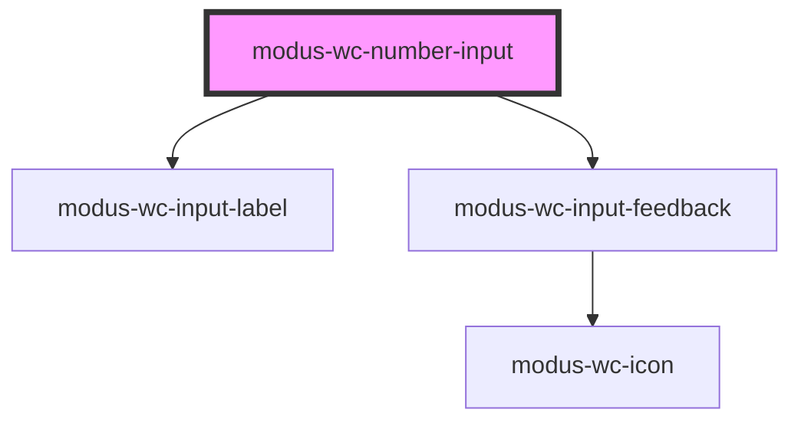

----------------------------------------------


---

# modus-wc-pagination


<!-- Auto Generated Below -->


## Overview

Pagination component to navigate through pages of content

## Properties

| Property          | Attribute           | Description                                                              | Type                            | Default     |
| ----------------- | ------------------- | ------------------------------------------------------------------------ | ------------------------------- | ----------- |
| `ariaLabelValues` | `aria-label-values` | Aria label values for pagination buttons                                 | `IAriaLabelValues \| undefined` | `undefined` |
| `count`           | `count`             | Total number of pages                                                    | `number`                        | `1`         |
| `customClass`     | `custom-class`      | Custom CSS class to apply                                                | `string \| undefined`           | `''`        |
| `nextButtonText`  | `next-button-text`  | The next page button text. If not set, an icon control will be used.     | `string \| undefined`           | `undefined` |
| `page`            | `page`              | The current page number                                                  | `number`                        | `1`         |
| `prevButtonText`  | `prev-button-text`  | The previous page button text. If not set, an icon control will be used. | `string \| undefined`           | `undefined` |
| `size`            | `size`              | Size of the pagination buttons                                           | `"lg" \| "md" \| "sm"`          | `'md'`      |


## Events

| Event        | Description                     | Type                       |
| ------------ | ------------------------------- | -------------------------- |
| `pageChange` | Event emitted when page changes | `CustomEvent<IPageChange>` |


## Dependencies

### Used by

 - [modus-wc-table](../modus-wc-table)

### Graph
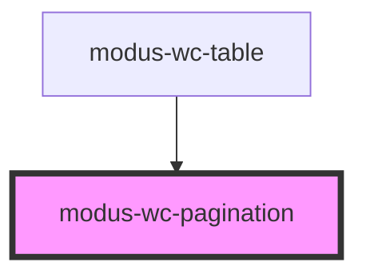

----------------------------------------------


---

# modus-wc-progress


<!-- Auto Generated Below -->


## Overview

A customizable progress component used to show the progress of a task or show the passing of time.

The radial variant supports slotting in custom HTML to be displayed within the progress circle

## Properties

| Property        | Attribute       | Description                                        | Type                                 | Default     |
| --------------- | --------------- | -------------------------------------------------- | ------------------------------------ | ----------- |
| `customClass`   | `custom-class`  | Custom CSS class to apply to the progress element. | `string \| undefined`                | `''`        |
| `indeterminate` | `indeterminate` | The indeterminate state of the progress component. | `boolean`                            | `false`     |
| `label`         | `label`         | A text label to render within the progress bar     | `string \| undefined`                | `undefined` |
| `max`           | `max`           | The progress component's maximum value.            | `number \| undefined`                | `100`       |
| `value`         | `value`         | The value of the progress component.               | `number`                             | `0`         |
| `variant`       | `variant`       | The variant of the progress component.             | `"default" \| "radial" \| undefined` | `'default'` |


## Dependencies

### Depends on

- [modus-wc-input-label](../modus-wc-input-label)

### Graph
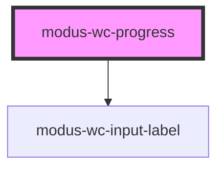

----------------------------------------------


---

# modus-wc-radio


<!-- Auto Generated Below -->


## Overview

A customizable radio component

## Properties

| Property        | Attribute         | Description                                                                     | Type                                | Default     |
| --------------- | ----------------- | ------------------------------------------------------------------------------- | ----------------------------------- | ----------- |
| `customClass`   | `custom-class`    | Custom CSS class to apply to the inner div.                                     | `string \| undefined`               | `''`        |
| `disabled`      | `disabled`        | The disabled state of the radio.                                                | `boolean \| undefined`              | `false`     |
| `inputId`       | `input-id`        | The ID of the input element.                                                    | `string \| undefined`               | `undefined` |
| `inputTabIndex` | `input-tab-index` | The tabindex of the input.                                                      | `number \| undefined`               | `undefined` |
| `label`         | `label`           | The text to display within the label.                                           | `string \| undefined`               | `undefined` |
| `name`          | `name`            | Name of the form control. Submitted with the form as part of a name/value pair. | `string \| undefined`               | `''`        |
| `required`      | `required`        | A value is required for the form to be submittable.                             | `boolean \| undefined`              | `false`     |
| `size`          | `size`            | The size of the input.                                                          | `"lg" \| "md" \| "sm" \| undefined` | `'md'`      |
| `value`         | `value`           | The value of the radio.                                                         | `boolean`                           | `false`     |


## Events

| Event         | Description                           | Type                      |
| ------------- | ------------------------------------- | ------------------------- |
| `inputBlur`   | Emitted when the input loses focus.   | `CustomEvent<FocusEvent>` |
| `inputChange` | Emitted when the input value changes. | `CustomEvent<InputEvent>` |
| `inputFocus`  | Emitted when the input gains focus.   | `CustomEvent<FocusEvent>` |


## Dependencies

### Depends on

- [modus-wc-input-label](../modus-wc-input-label)

### Graph
```mermaid
graph TD;
  modus-wc-radio --> modus-wc-input-label
  style modus-wc-radio fill:#f9f,stroke:#333,stroke-width:4px
```

----------------------------------------------


---

# modus-wc-rating


<!-- Auto Generated Below -->


## Overview

A rating component that allows users to choose a rating from predefined options

## Properties

| Property           | Attribute             | Description                                                             | Type                                             | Default                                                 |
| ------------------ | --------------------- | ----------------------------------------------------------------------- | ------------------------------------------------ | ------------------------------------------------------- |
| `allowHalf`        | `allow-half`          | Whether to allow half-ratings. Only applies to star and heart variants. | `boolean \| undefined`                           | `false`                                                 |
| `count`            | `count`               | The number of rating items to display                                   | `number`                                         | `5`                                                     |
| `customClass`      | `custom-class`        | Custom CSS class to apply                                               | `string \| undefined`                            | `''`                                                    |
| `disabled`         | `disabled`            | Whether the rating component is disabled                                | `boolean \| undefined`                           | `false`                                                 |
| `getAriaLabelText` | `get-aria-label-text` | Function to provide aria-label text for a given rating-item index       | `((ratingValue: number) => string) \| undefined` | `` (ratingValue) =>     `Rating item ${ratingValue}` `` |
| `size`             | `size`                | The size of the rating component                                        | `"lg" \| "md" \| "sm" \| undefined`              | `'md'`                                                  |
| `value`            | `value`               | The current value of the rating                                         | `number`                                         | `0`                                                     |
| `variant`          | `variant`             | The variant of the rating scale                                         | `"heart" \| "smiley" \| "star" \| "thumb"`       | `'smiley'`                                              |


## Events

| Event          | Description                           | Type                         |
| -------------- | ------------------------------------- | ---------------------------- |
| `ratingChange` | Event emitted when the rating changes | `CustomEvent<IRatingChange>` |


----------------------------------------------


---

# modus-wc-select


<!-- Auto Generated Below -->


## Overview

A customizable select component used to pick a value from a list of options

## Properties

| Property        | Attribute         | Description                                                                                             | Type                                | Default     |
| --------------- | ----------------- | ------------------------------------------------------------------------------------------------------- | ----------------------------------- | ----------- |
| `bordered`      | `bordered`        | Indicates that the input should have a border.                                                          | `boolean \| undefined`              | `true`      |
| `customClass`   | `custom-class`    | Custom CSS class to apply to the inner div.                                                             | `string \| undefined`               | `''`        |
| `disabled`      | `disabled`        | Whether the form control is disabled.                                                                   | `boolean \| undefined`              | `false`     |
| `feedback`      | `feedback`        | Feedback to render below the input.                                                                     | `IInputFeedbackProp \| undefined`   | `undefined` |
| `inputId`       | `input-id`        | The ID of the input element.                                                                            | `string \| undefined`               | `undefined` |
| `inputTabIndex` | `input-tab-index` | Determine the control's relative ordering for sequential focus navigation (typically with the Tab key). | `number \| undefined`               | `undefined` |
| `label`         | `label`           | The text to display within the label.                                                                   | `string \| undefined`               | `undefined` |
| `name`          | `name`            | Name of the form control. Submitted with the form as part of a name/value pair.                         | `string \| undefined`               | `undefined` |
| `options`       | `options`         | The options to display in the select dropdown.                                                          | `ISelectOption[]`                   | `[]`        |
| `required`      | `required`        | A value is required for the form to be submittable.                                                     | `boolean \| undefined`              | `false`     |
| `size`          | `size`            | The size of the input.                                                                                  | `"lg" \| "md" \| "sm" \| undefined` | `'md'`      |
| `value`         | `value`           | The value of the control.                                                                               | `string`                            | `''`        |


## Events

| Event         | Description                                 | Type                      |
| ------------- | ------------------------------------------- | ------------------------- |
| `inputBlur`   | Event emitted when the input loses focus.   | `CustomEvent<FocusEvent>` |
| `inputChange` | Event emitted when the input value changes. | `CustomEvent<InputEvent>` |
| `inputFocus`  | Event emitted when the input gains focus.   | `CustomEvent<FocusEvent>` |


## Dependencies

### Used by

 - [modus-wc-table](../modus-wc-table)

### Depends on

- [modus-wc-input-label](../modus-wc-input-label)
- [modus-wc-input-feedback](../modus-wc-input-feedback)

### Graph
```mermaid
graph TD;
  modus-wc-select --> modus-wc-input-label
  modus-wc-select --> modus-wc-input-feedback
  modus-wc-input-feedback --> modus-wc-icon
  modus-wc-table --> modus-wc-select
  style modus-wc-select fill:#f9f,stroke:#333,stroke-width:4px
```

----------------------------------------------


---

# modus-wc-side-navigation


<!-- Auto Generated Below -->


## Overview

A customizable side navigation component for organizing primary navigation and content areas in an application.

## Properties

| Property                 | Attribute                   | Description                                                              | Type                  | Default   |
| ------------------------ | --------------------------- | ------------------------------------------------------------------------ | --------------------- | --------- |
| `collapseOnClickOutside` | `collapse-on-click-outside` | Whether the side navigation should collapse when clicking outside of it. | `boolean`             | `true`    |
| `customClass`            | `custom-class`              | Custom CSS class to apply to the inner div.                              | `string \| undefined` | `''`      |
| `expanded`               | `expanded`                  | Whether the side navigation is expanded.                                 | `boolean`             | `false`   |
| `maxWidth`               | `max-width`                 | Maximum width of the side navigation panel in an expanded state.         | `string`              | `'256px'` |


----------------------------------------------


---

# modus-wc-skeleton


<!-- Auto Generated Below -->


## Overview

A customizable skeleton component used to create skeletons of various sizes and shapes

## Properties

| Property      | Attribute      | Description                                 | Type                                   | Default                            |
| ------------- | -------------- | ------------------------------------------- | -------------------------------------- | ---------------------------------- |
| `customClass` | `custom-class` | Custom CSS class to apply to the inner div. | `string \| undefined`                  | `''`                               |
| `height`      | `height`       | The height of the skeleton.                 | `string`                               | `'var(--modus-wc-line-height-md)'` |
| `shape`       | `shape`        | The shape of the skeleton.                  | `"circle" \| "rectangle" \| undefined` | `'rectangle'`                      |
| `width`       | `width`        | The width of the skeleton.                  | `string`                               | `'100%'`                           |


----------------------------------------------


---

# modus-wc-slider


<!-- Auto Generated Below -->


## Overview

A customizable slider component

## Properties

| Property        | Attribute         | Description                                                                     | Type                                | Default     |
| --------------- | ----------------- | ------------------------------------------------------------------------------- | ----------------------------------- | ----------- |
| `customClass`   | `custom-class`    | Custom CSS class to apply to the inner div.                                     | `string \| undefined`               | `''`        |
| `disabled`      | `disabled`        | The disabled state of the slider.                                               | `boolean \| undefined`              | `false`     |
| `inputId`       | `input-id`        | The ID of the input element.                                                    | `string \| undefined`               | `undefined` |
| `inputTabIndex` | `input-tab-index` | The tabindex of the input.                                                      | `number \| undefined`               | `undefined` |
| `label`         | `label`           | The text to display within the label.                                           | `string \| undefined`               | `undefined` |
| `max`           | `max`             | The maximum slider value.                                                       | `number \| undefined`               | `undefined` |
| `min`           | `min`             | The minimum slider value.                                                       | `number \| undefined`               | `undefined` |
| `name`          | `name`            | Name of the form control. Submitted with the form as part of a name/value pair. | `string \| undefined`               | `''`        |
| `required`      | `required`        | A value is required for the form to be submittable.                             | `boolean \| undefined`              | `false`     |
| `size`          | `size`            | The size of the input.                                                          | `"lg" \| "md" \| "sm" \| undefined` | `'md'`      |
| `step`          | `step`            | The increment of the slider.                                                    | `number \| undefined`               | `undefined` |
| `value`         | `value`           | The value of the slider.                                                        | `number`                            | `0`         |


## Events

| Event         | Description                           | Type                      |
| ------------- | ------------------------------------- | ------------------------- |
| `inputBlur`   | Emitted when the input loses focus.   | `CustomEvent<FocusEvent>` |
| `inputChange` | Emitted when the input value changes. | `CustomEvent<InputEvent>` |
| `inputFocus`  | Emitted when the input gains focus.   | `CustomEvent<FocusEvent>` |


## Dependencies

### Depends on

- [modus-wc-input-label](../modus-wc-input-label)

### Graph
```mermaid
graph TD;
  modus-wc-slider --> modus-wc-input-label
  style modus-wc-slider fill:#f9f,stroke:#333,stroke-width:4px
```

----------------------------------------------


---

# modus-wc-stepper


<!-- Auto Generated Below -->


## Overview

Used to show a list of steps in a process.

## Properties

| Property      | Attribute      | Description                                     | Type                                      | Default     |
| ------------- | -------------- | ----------------------------------------------- | ----------------------------------------- | ----------- |
| `customClass` | `custom-class` | Custom CSS class to apply to the steps element. | `string \| undefined`                     | `''`        |
| `orientation` | `orientation`  | The orientation of the steps.                   | `"horizontal" \| "vertical" \| undefined` | `undefined` |
| `steps`       | `steps`        | The steps to display.                           | `IStepperItem[]`                          | `[]`        |


----------------------------------------------


---

# modus-wc-switch


<!-- Auto Generated Below -->


## Overview

A customizable checkbox component

## Properties

| Property        | Attribute         | Description                                                                     | Type                                | Default     |
| --------------- | ----------------- | ------------------------------------------------------------------------------- | ----------------------------------- | ----------- |
| `customClass`   | `custom-class`    | Custom CSS class to apply to the inner div.                                     | `string \| undefined`               | `''`        |
| `disabled`      | `disabled`        | The disabled state of the switch.                                               | `boolean \| undefined`              | `false`     |
| `indeterminate` | `indeterminate`   | The indeterminate state of the switch.                                          | `boolean`                           | `false`     |
| `inputId`       | `input-id`        | The ID of the input element.                                                    | `string \| undefined`               | `undefined` |
| `inputTabIndex` | `input-tab-index` | The tabindex of the input.                                                      | `number \| undefined`               | `undefined` |
| `label`         | `label`           | The text to display within the label.                                           | `string \| undefined`               | `undefined` |
| `name`          | `name`            | Name of the form control. Submitted with the form as part of a name/value pair. | `string \| undefined`               | `''`        |
| `required`      | `required`        | A value is required for the form to be submittable.                             | `boolean \| undefined`              | `false`     |
| `size`          | `size`            | The size of the input.                                                          | `"lg" \| "md" \| "sm" \| undefined` | `'md'`      |
| `value`         | `value`           | The value of the switch.                                                        | `boolean`                           | `false`     |


## Events

| Event         | Description                           | Type                      |
| ------------- | ------------------------------------- | ------------------------- |
| `inputBlur`   | Emitted when the input loses focus.   | `CustomEvent<FocusEvent>` |
| `inputChange` | Emitted when the input value changes. | `CustomEvent<InputEvent>` |
| `inputFocus`  | Emitted when the input gains focus.   | `CustomEvent<FocusEvent>` |


## Dependencies

### Depends on

- [modus-wc-input-label](../modus-wc-input-label)

### Graph
```mermaid
graph TD;
  modus-wc-switch --> modus-wc-input-label
  style modus-wc-switch fill:#f9f,stroke:#333,stroke-width:4px
```

----------------------------------------------


---

# modus-wc-table


<!-- Auto Generated Below -->


## Properties

| Property               | Attribute                 | Description                                                                                      | Type                                                                  | Default         |
| ---------------------- | ------------------------- | ------------------------------------------------------------------------------------------------ | --------------------------------------------------------------------- | --------------- |
| `columns` _(required)_ | `columns`                 | An array of column definitions.                                                                  | `ITableColumn[]`                                                      | `undefined`     |
| `currentPage`          | `current-page`            | The current page number in pagination (1-based index).                                           | `number`                                                              | `1`             |
| `customClass`          | `custom-class`            | Custom CSS class to apply to the inner div.                                                      | `string \| undefined`                                                 | `''`            |
| `data` _(required)_    | `data`                    | An array of data objects.                                                                        | `Record<string, unknown>[]`                                           | `undefined`     |
| `density`              | `density`                 | The density of the table, used to save space or increase readability.                            | `"comfortable" \| "compact" \| "relaxed" \| undefined`                | `'comfortable'` |
| `editable`             | `editable`                | Enable cell editing. Either a boolean (all rows) or a predicate per row.                         | `((row: Record<string, unknown>) => boolean) \| boolean \| undefined` | `false`         |
| `hover`                | `hover`                   | Enable hover effect on table rows.                                                               | `boolean \| undefined`                                                | `true`          |
| `pageSizeOptions`      | `page-size-options`       | Available options for the number of rows per page.                                               | `number[]`                                                            | `[5, 10, 15]`   |
| `paginated`            | `paginated`               | Enable pagination for the table.                                                                 | `boolean \| undefined`                                                | `false`         |
| `selectable`           | `selectable`              | Row selection mode: 'none' for no selection, 'single' for single row, 'multi' for multiple rows. | `"multi" \| "none" \| "single" \| undefined`                          | `'none'`        |
| `selectedRowIds`       | `selected-row-ids`        | Array of selected row IDs. Used for controlled selection state.                                  | `string[] \| undefined`                                               | `undefined`     |
| `showPageSizeSelector` | `show-page-size-selector` | Show/hide the page size selector in pagination.                                                  | `boolean \| undefined`                                                | `true`          |
| `sortable`             | `sortable`                | Enable sorting functionality for sortable columns.                                               | `boolean \| undefined`                                                | `true`          |
| `zebra`                | `zebra`                   | Zebra striped tables differentiate rows by styling them in an alternating fashion.               | `boolean \| undefined`                                                | `false`         |


## Events

| Event                | Description                                                            | Type                                                                                                        |
| -------------------- | ---------------------------------------------------------------------- | ----------------------------------------------------------------------------------------------------------- |
| `cellEditCommit`     | Emits when cell editing is committed with the new value.               | `CustomEvent<{ rowIndex: number; colId: string; newValue: unknown; updatedRow: Record<string, unknown>; }>` |
| `cellEditStart`      | Emits when cell editing starts.                                        | `CustomEvent<{ rowIndex: number; colId: string; }>`                                                         |
| `paginationChange`   | Emits when pagination changes with the new pagination state.           | `CustomEvent<IPaginationChangeEventDetail>`                                                                 |
| `rowClick`           | Emits when a row is clicked.                                           | `CustomEvent<{ row: Record<string, unknown>; index: number; }>`                                             |
| `rowSelectionChange` | Emits when row selection changes with the selected rows and their IDs. | `CustomEvent<{ selectedRows: Record<string, unknown>[]; selectedRowIds: string[]; }>`                       |
| `sortChange`         | Emits when sorting changes with the new sorting state.                 | `CustomEvent<ColumnSort[]>`                                                                                 |


## Dependencies

### Depends on

- [modus-wc-select](../modus-wc-select)
- [modus-wc-checkbox](../modus-wc-checkbox)
- [modus-wc-icon](../modus-wc-icon)
- [modus-wc-pagination](../modus-wc-pagination)

### Graph
```mermaid
graph TD;
  modus-wc-table --> modus-wc-select
  modus-wc-table --> modus-wc-checkbox
  modus-wc-table --> modus-wc-icon
  modus-wc-table --> modus-wc-pagination
  modus-wc-select --> modus-wc-input-label
  modus-wc-select --> modus-wc-input-feedback
  modus-wc-input-feedback --> modus-wc-icon
  modus-wc-checkbox --> modus-wc-input-label
  style modus-wc-table fill:#f9f,stroke:#333,stroke-width:4px
```

----------------------------------------------


---

# modus-wc-tabs


<!-- Auto Generated Below -->


## Overview

A customizable tabs component used to create groups of tabs.

## Properties

| Property         | Attribute          | Description                                 | Type                                                       | Default      |
| ---------------- | ------------------ | ------------------------------------------- | ---------------------------------------------------------- | ------------ |
| `activeTabIndex` | `active-tab-index` | The current active tab                      | `number`                                                   | `0`          |
| `customClass`    | `custom-class`     | Custom CSS class to apply to the inner div. | `string \| undefined`                                      | `''`         |
| `size`           | `size`             | The size of the tabs.                       | `"lg" \| "md" \| "sm" \| undefined`                        | `'md'`       |
| `tabStyle`       | `tab-style`        | Additional styling for the tabs.            | `"bordered" \| "boxed" \| "lifted" \| "none" \| undefined` | `'bordered'` |
| `tabs`           | `tabs`             | The tabs to display.                        | `ITab[]`                                                   | `[]`         |


## Events

| Event       | Description                                                        | Type                                                    |
| ----------- | ------------------------------------------------------------------ | ------------------------------------------------------- |
| `tabChange` | When a tab is switched to, this event outputs the relevant indices | `CustomEvent<{ previousTab: number; newTab: number; }>` |


## Dependencies

### Depends on

- [modus-wc-icon](../modus-wc-icon)

### Graph
```mermaid
graph TD;
  modus-wc-tabs --> modus-wc-icon
  style modus-wc-tabs fill:#f9f,stroke:#333,stroke-width:4px
```

----------------------------------------------


---

# modus-wc-text-input


<!-- Auto Generated Below -->


## Overview

A customizable input component used to create text inputs with types.

## Properties

| Property         | Attribute          | Description                                                                                                                                                              | Type                                                                                                                                                  | Default        |
| ---------------- | ------------------ | ------------------------------------------------------------------------------------------------------------------------------------------------------------------------ | ----------------------------------------------------------------------------------------------------------------------------------------------------- | -------------- |
| `autoCapitalize` | `auto-capitalize`  | Controls automatic capitalization in inputted text.                                                                                                                      | `"characters" \| "none" \| "off" \| "on" \| "sentences" \| "words" \| undefined`                                                                      | `undefined`    |
| `autoComplete`   | `auto-complete`    | Hint for form autofill feature.                                                                                                                                          | `AutocompleteTypes \| undefined`                                                                                                                      | `undefined`    |
| `autoCorrect`    | `auto-correct`     | Controls automatic correction in inputted text. Support by browser varies.                                                                                               | `"off" \| "on" \| undefined`                                                                                                                          | `undefined`    |
| `bordered`       | `bordered`         | Indicates that the input should have a border.                                                                                                                           | `boolean \| undefined`                                                                                                                                | `true`         |
| `clearAriaLabel` | `clear-aria-label` | Aria label for the clear icon button.                                                                                                                                    | `string \| undefined`                                                                                                                                 | `'Clear text'` |
| `customClass`    | `custom-class`     | Custom CSS class to apply to the input.                                                                                                                                  | `string \| undefined`                                                                                                                                 | `''`           |
| `disabled`       | `disabled`         | Whether the form control is disabled.                                                                                                                                    | `boolean \| undefined`                                                                                                                                | `false`        |
| `enterkeyhint`   | `enterkeyhint`     | A hint to the browser for which enter key to display.                                                                                                                    | `"done" \| "enter" \| "go" \| "next" \| "previous" \| "search" \| "send" \| undefined`                                                                | `undefined`    |
| `feedback`       | `feedback`         | Feedback to render below the input.                                                                                                                                      | `IInputFeedbackProp \| undefined`                                                                                                                     | `undefined`    |
| `includeClear`   | `include-clear`    | Show the clear button within the input field.                                                                                                                            | `boolean \| undefined`                                                                                                                                | `false`        |
| `includeSearch`  | `include-search`   | Show the search icon within the input field.                                                                                                                             | `boolean \| undefined`                                                                                                                                | `false`        |
| `inputId`        | `input-id`         | The ID of the input element.                                                                                                                                             | `string \| undefined`                                                                                                                                 | `undefined`    |
| `inputMode`      | `input-mode`       | Hints at the type of data that might be entered by the user while editing the element or its contents. This allows a browser to display an appropriate virtual keyboard. | `"decimal" \| "email" \| "none" \| "numeric" \| "search" \| "tel" \| "text" \| "url"`                                                                 | `'text'`       |
| `inputTabIndex`  | `input-tab-index`  | Determine the control's relative ordering for sequential focus navigation (typically with the Tab key).                                                                  | `number \| undefined`                                                                                                                                 | `undefined`    |
| `label`          | `label`            | The text to display within the label.                                                                                                                                    | `string \| undefined`                                                                                                                                 | `undefined`    |
| `maxLength`      | `max-length`       | Maximum length (number of characters) of value.                                                                                                                          | `number \| undefined`                                                                                                                                 | `undefined`    |
| `minLength`      | `min-length`       | Minimum length (number of characters) of value.                                                                                                                          | `number \| undefined`                                                                                                                                 | `undefined`    |
| `name`           | `name`             | Name of the form control. Submitted with the form as part of a name/value pair.                                                                                          | `string \| undefined`                                                                                                                                 | `undefined`    |
| `pattern`        | `pattern`          | Pattern the value must match to be valid                                                                                                                                 | `string \| undefined`                                                                                                                                 | `undefined`    |
| `placeholder`    | `placeholder`      | Text that appears in the form control when it has no value set.                                                                                                          | `string \| undefined`                                                                                                                                 | `''`           |
| `readOnly`       | `read-only`        | Whether the value is editable.                                                                                                                                           | `boolean \| undefined`                                                                                                                                | `false`        |
| `required`       | `required`         | A value is required for the form to be submittable.                                                                                                                      | `boolean \| undefined`                                                                                                                                | `false`        |
| `size`           | `size`             | The size of the input.                                                                                                                                                   | `"lg" \| "md" \| "sm" \| undefined`                                                                                                                   | `'md'`         |
| `type`           | `type`             | Type of form control.                                                                                                                                                    | `"date" \| "datetime-local" \| "email" \| "month" \| "number" \| "password" \| "search" \| "tel" \| "text" \| "time" \| "url" \| "week" \| undefined` | `'text'`       |
| `value`          | `value`            | The value of the control.                                                                                                                                                | `string`                                                                                                                                              | `''`           |


## Events

| Event         | Description                                 | Type                      |
| ------------- | ------------------------------------------- | ------------------------- |
| `inputBlur`   | Event emitted when the input loses focus.   | `CustomEvent<FocusEvent>` |
| `inputChange` | Event emitted when the input value changes. | `CustomEvent<InputEvent>` |
| `inputFocus`  | Event emitted when the input gains focus.   | `CustomEvent<FocusEvent>` |


## Dependencies

### Used by

 - [modus-wc-autocomplete](../modus-wc-autocomplete)
 - [modus-wc-navbar](../modus-wc-navbar)

### Depends on

- [modus-wc-input-label](../modus-wc-input-label)
- [modus-wc-input-feedback](../modus-wc-input-feedback)

### Graph
```mermaid
graph TD;
  modus-wc-text-input --> modus-wc-input-label
  modus-wc-text-input --> modus-wc-input-feedback
  modus-wc-input-feedback --> modus-wc-icon
  modus-wc-autocomplete --> modus-wc-text-input
  modus-wc-navbar --> modus-wc-text-input
  style modus-wc-text-input fill:#f9f,stroke:#333,stroke-width:4px
```

----------------------------------------------


---

# modus-wc-textarea


<!-- Auto Generated Below -->


## Overview

A customizable textarea component.

## Properties

| Property        | Attribute         | Description                                                                     | Type                                                                                   | Default     |
| --------------- | ----------------- | ------------------------------------------------------------------------------- | -------------------------------------------------------------------------------------- | ----------- |
| `autoCorrect`   | `auto-correct`    | Controls automatic correction in inputted text. Support by browser varies.      | `"off" \| "on" \| undefined`                                                           | `undefined` |
| `bordered`      | `bordered`        | Indicates that the input should have a border.                                  | `boolean \| undefined`                                                                 | `true`      |
| `customClass`   | `custom-class`    | Custom CSS class to apply to the textarea (supports DaisyUI).                   | `string \| undefined`                                                                  | `''`        |
| `disabled`      | `disabled`        | The disabled state of the textarea.                                             | `boolean \| undefined`                                                                 | `false`     |
| `enterkeyhint`  | `enterkeyhint`    | A hint to the browser for which enter key to display.                           | `"done" \| "enter" \| "go" \| "next" \| "previous" \| "search" \| "send" \| undefined` | `undefined` |
| `feedback`      | `feedback`        | Feedback to render below the input.                                             | `IInputFeedbackProp \| undefined`                                                      | `undefined` |
| `inputId`       | `input-id`        | The ID of the input element.                                                    | `string \| undefined`                                                                  | `undefined` |
| `inputTabIndex` | `input-tab-index` | The tabindex of the input.                                                      | `number \| undefined`                                                                  | `undefined` |
| `label`         | `label`           | The text to display within the label.                                           | `string \| undefined`                                                                  | `undefined` |
| `maxLength`     | `max-length`      | The maximum number of characters allowed in the textarea.                       | `number \| undefined`                                                                  | `undefined` |
| `name`          | `name`            | Name of the form control. Submitted with the form as part of a name/value pair. | `string \| undefined`                                                                  | `undefined` |
| `placeholder`   | `placeholder`     | The placeholder text for the textarea.                                          | `string \| undefined`                                                                  | `''`        |
| `readonly`      | `readonly`        | The readonly state of the textarea.                                             | `boolean \| undefined`                                                                 | `false`     |
| `required`      | `required`        | A value is required for the form to be submittable.                             | `boolean \| undefined`                                                                 | `false`     |
| `rows`          | `rows`            | The number of visible text lines for the textarea.                              | `number \| undefined`                                                                  | `undefined` |
| `size`          | `size`            | The size of the input.                                                          | `"lg" \| "md" \| "sm" \| undefined`                                                    | `'md'`      |
| `value`         | `value`           | The value of the textarea.                                                      | `string`                                                                               | `''`        |


## Events

| Event         | Description                           | Type                      |
| ------------- | ------------------------------------- | ------------------------- |
| `inputBlur`   | Emitted when the input loses focus.   | `CustomEvent<FocusEvent>` |
| `inputChange` | Emitted when the input value changes. | `CustomEvent<InputEvent>` |
| `inputFocus`  | Emitted when the input gains focus.   | `CustomEvent<FocusEvent>` |


## Dependencies

### Depends on

- [modus-wc-input-label](../modus-wc-input-label)
- [modus-wc-input-feedback](../modus-wc-input-feedback)

### Graph
```mermaid
graph TD;
  modus-wc-textarea --> modus-wc-input-label
  modus-wc-textarea --> modus-wc-input-feedback
  modus-wc-input-feedback --> modus-wc-icon
  style modus-wc-textarea fill:#f9f,stroke:#333,stroke-width:4px
```

----------------------------------------------


---

# modus-wc-theme-switcher


<!-- Auto Generated Below -->


## Overview

A theme switcher component used to toggle the application theme and/or mode.

Allows consumers to set the initial theme (Modus Classic, Modus Modern, etc.) and end-users to toggle modes (Light, Dark).

## Properties

| Property      | Attribute      | Description                                              | Type                  | Default |
| ------------- | -------------- | -------------------------------------------------------- | --------------------- | ------- |
| `customClass` | `custom-class` | Custom CSS class to apply to the theme switcher element. | `string \| undefined` | `''`    |


## Events

| Event         | Description                                    | Type                        |
| ------------- | ---------------------------------------------- | --------------------------- |
| `themeChange` | An event that fires when the theme is changed. | `CustomEvent<IThemeConfig>` |


----------------------------------------------


---

# modus-wc-time-input


<!-- Auto Generated Below -->


## Overview

A customizable input component used to create time inputs.

## Properties

| Property          | Attribute          | Description                                                                                                                                                                                                                                                                  | Type                                | Default     |
| ----------------- | ------------------ | ---------------------------------------------------------------------------------------------------------------------------------------------------------------------------------------------------------------------------------------------------------------------------- | ----------------------------------- | ----------- |
| `autoComplete`    | `auto-complete`    | Hint for form autofill feature.                                                                                                                                                                                                                                              | `"off" \| "on" \| undefined`        | `undefined` |
| `bordered`        | `bordered`         | Indicates that the input should have a border.                                                                                                                                                                                                                               | `boolean \| undefined`              | `true`      |
| `customClass`     | `custom-class`     | Custom CSS class to apply to the input.                                                                                                                                                                                                                                      | `string \| undefined`               | `''`        |
| `datalistId`      | `datalist-id`      | ID of a `<datalist>` element that contains pre-defined time options. The value must be the ID of a `<datalist>` element in the same document.                                                                                                                                | `string \| undefined`               | `undefined` |
| `datalistOptions` | `datalist-options` | The options to display in the time input dropdown. Options must be in `HH:mm` or `HH:mm:ss` format.                                                                                                                                                                          | `string[]`                          | `[]`        |
| `disabled`        | `disabled`         | Whether the form control is disabled.                                                                                                                                                                                                                                        | `boolean \| undefined`              | `false`     |
| `feedback`        | `feedback`         | Feedback to render below the input.                                                                                                                                                                                                                                          | `IInputFeedbackProp \| undefined`   | `undefined` |
| `inputId`         | `input-id`         | The ID of the input element.                                                                                                                                                                                                                                                 | `string \| undefined`               | `undefined` |
| `inputTabIndex`   | `input-tab-index`  | Determine the control's relative ordering for sequential focus navigation (typically with the Tab key).                                                                                                                                                                      | `number \| undefined`               | `undefined` |
| `label`           | `label`            | The text to display within the label.                                                                                                                                                                                                                                        | `string \| undefined`               | `undefined` |
| `max`             | `max`              | Maximum value. Format: `HH:mm`, `HH:mm:ss`.                                                                                                                                                                                                                                  | `string \| undefined`               | `undefined` |
| `min`             | `min`              | Minimum value. Format: `HH:mm`, `HH:mm:ss.`                                                                                                                                                                                                                                  | `string \| undefined`               | `undefined` |
| `name`            | `name`             | Name of the form control. Submitted with the form as part of a name/value pair.                                                                                                                                                                                              | `string \| undefined`               | `undefined` |
| `readOnly`        | `read-only`        | Whether the value is editable.                                                                                                                                                                                                                                               | `boolean \| undefined`              | `false`     |
| `required`        | `required`         | A value is required for the form to be submittable.                                                                                                                                                                                                                          | `boolean \| undefined`              | `false`     |
| `showSeconds`     | `show-seconds`     | Displays the time input format as `HH:mm:ss` if `true`. Internally sets the `step` to 1 second. If a `step` value is provided, it will override this attribute.                                                                                                              | `boolean \| undefined`              | `false`     |
| `size`            | `size`             | The size of the input.                                                                                                                                                                                                                                                       | `"lg" \| "md" \| "sm" \| undefined` | `'md'`      |
| `step`            | `step`             | Specifies the granularity that the `value` must adhere to. Value of step given in seconds. Default value is 60 seconds. Overrides the `seconds` attribute if both are provided.                                                                                              | `number \| undefined`               | `undefined` |
| `value`           | `value`            | The value of the time input. Always in 24-hour format that includes leading zeros: `HH:mm` or `HH:mm:ss`, regardless of input format which is likely to be selected based on user's locale (or by the user agent). If time includes seconds the format is always `HH:mm:ss`. | `string`                            | `''`        |


## Events

| Event         | Description                                 | Type                      |
| ------------- | ------------------------------------------- | ------------------------- |
| `inputBlur`   | Event emitted when the input loses focus.   | `CustomEvent<FocusEvent>` |
| `inputChange` | Event emitted when the input value changes. | `CustomEvent<Event>`      |
| `inputFocus`  | Event emitted when the input gains focus.   | `CustomEvent<FocusEvent>` |


## Dependencies

### Depends on

- [modus-wc-input-label](../modus-wc-input-label)
- [modus-wc-input-feedback](../modus-wc-input-feedback)

### Graph
```mermaid
graph TD;
  modus-wc-time-input --> modus-wc-input-label
  modus-wc-time-input --> modus-wc-input-feedback
  modus-wc-input-feedback --> modus-wc-icon
  style modus-wc-time-input fill:#f9f,stroke:#333,stroke-width:4px
```

----------------------------------------------


---

# modus-wc-toast


<!-- Auto Generated Below -->


## Overview

A customizable toast component used to stack elements, positioned on the corner of a page.

The component supports a `<slot>` for injecting additional custom content inside the toast.

## Properties

| Property      | Attribute      | Description                                        | Type                                                                                                                                                              | Default     |
| ------------- | -------------- | -------------------------------------------------- | ----------------------------------------------------------------------------------------------------------------------------------------------------------------- | ----------- |
| `customClass` | `custom-class` | Additional classes for custom styling.             | `string \| undefined`                                                                                                                                             | `''`        |
| `delay`       | `delay`        | Time taken to dismiss the toast in milliseconds    | `number \| undefined`                                                                                                                                             | `undefined` |
| `position`    | `position`     | The position of the toast in the parent container. | `"bottom-center" \| "bottom-end" \| "bottom-start" \| "middle-center" \| "middle-end" \| "middle-start" \| "top-center" \| "top-end" \| "top-start" \| undefined` | `'top-end'` |


----------------------------------------------


---

# modus-wc-toolbar


<!-- Auto Generated Below -->


## Overview

A customizable toolbar component used to organize content across the entire page.

## Properties

| Property      | Attribute      | Description                                 | Type                  | Default |
| ------------- | -------------- | ------------------------------------------- | --------------------- | ------- |
| `customClass` | `custom-class` | Custom CSS class to apply to the outer div. | `string \| undefined` | `''`    |


## Dependencies

### Used by

 - [modus-wc-navbar](../modus-wc-navbar)

### Graph
```mermaid
graph TD;
  modus-wc-navbar --> modus-wc-toolbar
  style modus-wc-toolbar fill:#f9f,stroke:#333,stroke-width:4px
```

----------------------------------------------


---

# modus-wc-tooltip


<!-- Auto Generated Below -->


## Overview

A customizable tooltip component used to create tooltips with different content.

## Properties

| Property      | Attribute      | Description                                                                                             | Type                                                            | Default     |
| ------------- | -------------- | ------------------------------------------------------------------------------------------------------- | --------------------------------------------------------------- | ----------- |
| `content`     | `content`      | The text content of the tooltip.                                                                        | `string`                                                        | `''`        |
| `customClass` | `custom-class` | Custom CSS class to apply to the inner div.                                                             | `string \| undefined`                                           | `''`        |
| `disabled`    | `disabled`     | Disables displaying the tooltip on hover                                                                | `boolean \| undefined`                                          | `false`     |
| `forceOpen`   | `force-open`   | Use this attribute to force the tooltip to remain open.                                                 | `boolean \| undefined`                                          | `undefined` |
| `position`    | `position`     | The position that the tooltip will render in relation to the element.                                   | `"auto" \| "bottom" \| "left" \| "right" \| "top" \| undefined` | `'auto'`    |
| `tooltipId`   | `tooltip-id`   | The ID of the tooltip element, useful for setting the "aria-describedby" attribute of related elements. | `string \| undefined`                                           | `undefined` |


----------------------------------------------


---

# modus-wc-typography


<!-- Auto Generated Below -->


## Overview

A customizable typography component used to render text with different sizes, variants, and weights.

## Properties

| Property      | Attribute      | Description                                          | Type                                                            | Default    |
| ------------- | -------------- | ---------------------------------------------------- | --------------------------------------------------------------- | ---------- |
| `customClass` | `custom-class` | Custom CSS class to apply to the typography element. | `string \| undefined`                                           | `''`       |
| `size`        | `size`         | The size of the font.                                | `"lg" \| "md" \| "sm" \| "xs" \| undefined`                     | `'md'`     |
| `variant`     | `variant`      | The variant of the typography component.             | `"body" \| "h1" \| "h2" \| "h3" \| "h4" \| "h5" \| "h6" \| "p"` | `'p'`      |
| `weight`      | `weight`       | The weight of the text.                              | `"bold" \| "light" \| "normal" \| "semibold" \| undefined`      | `'normal'` |


----------------------------------------------


